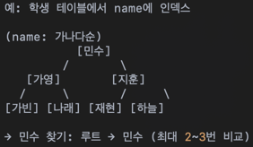

데이터베이스 인덱스
=============

데이터베이스
---------
-------

## 1.인덱스란?

인덱스는 데이터베이스 테이블의 특정 컬럼에 대한 "검색 속도"를 높이기 위한 자료 구조이다.

## 2.인덱스를 사용하는 이유
* 인덱스가 없으면?

특정 데이터를 찾기 위해 테이블 전체를 처음부터 끝까지 순차 검색(Full Table Scan)을 해야 된다.(속도가 느림)

* 인덱스가 있으면?

원하는 값을 빠르게 탐색 가능 -> 검색 성능 극대화

## 3.인덱스의 동작 원리

대표적인 인덱스 구조: B-Tree
* 대부분의 RDBMS(MySQL, Oracle, PostgreSQL 등)는 B-Tree 인덱스를 기본으로 사용한다
* 이진 탐색처럼 log(n) 복잡도로 데이터 접근 가능

## 4.인덱스 종류

1. 기본 인덱스
* 하나의 컬럼에 대해 생성
* ex) CREATE INDEX idx_name ON students(name);

2. 복합 인덱스
* 여러 컬럼을 묶어 인덱스를 생성
* ex) CREATE INDEX idx_ab ON students(A, B);
* B-Tree를 사용한 DB의 인덱스는 정렬된 트리 구조를 가지고 있다. 이때, 다중 칼럼(Composite) 인덱스를 사용할 경우, 왼쪽(Left-most) 값이 기준이 된다는 개념이다.

### 정리
* B-Tree에서 인덱스는 "왼쪽(Left-most)칼럼"을 기준으로 먼저 정렬된다.
* 왼쪽 칼럼(A)로 먼저 필터링한 후, 같은 값에서 오른쪽 칼럼(B)으로 정렬된다.
* 인덱스를 제대로 활용하려면 "왼쪽 칼럼은 먼저 검색"하는 게 중요하다.
* B 칼럼만 단독으로 검색하면 인덱스를 효과적으로 사용할 수 없다.

3. 고유 인덱스
* 중복을 허용하지 않는 인덱스(PRIMARY KEY, UNIQUE 제약조건도 내부적으로 유니크 인덱스 사용)
* ex) CREATE UNIQUE INDEX idx_email ON users(email)

4. 풀텍스트 인덱스
* 문자열 검색 최적화용(MySQL에서는 FULLTEXT)
* 긴 텍스트에서 단어 단위 검색 가능

5. 해시 인덱스
* 해시 함수로 직접 값을 찾아감(MySQL의 MEMORY 엔진 등)
* 검색은 빠르지만 범위 검색 불가능
* ex) WHERE name = '민수'는 빠름, WHERE name > '가영' 은 불가능

6. 비트맵 인덱스
* 값의 종류가 적은 컬럼에 사용(ex: 성별, 요일)
* 공간 효율적이며 AND/OR 조건에 강함

## 5.인덱스를 사용하면 좋은 경우
* WHERE 조건에 자주 쓰이는 컬럼
* JOIN, ORDER BY, GROUP BY에 자주 쓰이는 컬럼
* 데이터 양이 많은 테이블에서 특정 소수만 조회하는 경우

## 6.인덱스를 사용하면 안 좋은 경우
* 테이블이 아주 적음: 전체 스캔이 더 빠를 수 있다.
* 인덱스 컬럼의 중복도가 높음(선택도 낮음): 성능 이득이 거의 없다.
* 너무 많은 인덱스를 생성: 쓰기 성능 저하(INSERT/UPDATE/DELETE 시마다 인덱스도 갱신됨)
* 자주 변경되는 컬럼: 인덱스 유지 비용이 크다.