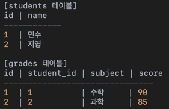

데이터베이스 조인
=============

데이터베이스
---------
-------

## JOIN이란?

JOIN은 두 개 이상의 테이블을 연결하여 관련된 데이터를 하나의 결과로 합치는 SQL 연산자이다.

관계형 데이터베이스에서 테이블 간의 관계(보통 외래키)를 기반으로 데이터를 조회할 수 있게 해준다.

## JOIN이 필요한 이유

학생 이름과 과목 점수를 함께 보려면 두 테이블을 JOIN해야 한다.

## JOIN의 종류
* INNER JOIN: 두 테이블에 모두 있는 값만 결과로
<pre><code>
SELECT s.name, g.subject, g.score
FROM students s
INNER JOIN grades g ON s.id = g.student_id;
</code></pre>

s.id = g.student_id가 일치하는 행만 출력

* LEFT JOIN: 왼쪽 테이블은 모두, 오른쪽은 일치하는 값만
<pre><code>
SELECT s.name, g.subject, g.score
FROM students s
LEFT JOIN grades g ON s.id = g.student_id;
</code></pre>

성적이 없는 학생도 출력된다.

* RIGHT JOIN: 오른쪽 테이블은 모두, 왼쪽은 일치하는 값만
<pre><code>
SELECT s.name, g.subject, g.score
FROM students s
RIGHT JOIN grades g ON s.id = g.student_id;
</code></pre>

학생 정보가 없는 성적도 출력(학생은 NULL)

* FULL OUTER JOIN: 양쪽 테이블의 모든 데이터, 일치하지 않으면 NULL(MySQL에서는 직접 지원 안 함 -> UNION 사용)

-- PostgreSQL, Oracle 등에서 가능
<pre><code>
SELECT s.name, g.subject, g.score
FROM students s
FULL OUTER JOIN grades g ON s.id = g.student_id;
</code></pre>
-- MySQL
<pre><code>
SELECT s.name, g.subject, g.score
FROM students s
LEFT JOIN grades g ON s.id = g.student_id
UNION
SELECT s.name, g.subject, g.score
FROM students s
RIGHT JOIN grades g ON s.id = g.student_id;
</code></pre>

* SELF JOIN: 자기 자신과 JOIN

하나의 테이블을 두 번 JOIN
<pre><code>
SELECT a.name AS 직원, b.name AS 상사
FROM employees a
JOIN employees b ON a.manager_id = b.id;
</code></pre>

* CROSS JOIN: 모든 조합(카테시안 곱)
<pre><code>
SELECT *
FROM students
CROSS JOIN subjects;
</code></pre>

## JOIN 관련 성능
* JOIN 대상 칼럼에 INDEX가 있으면 성능 향상
* JOIN 순서는 쿼리 최적화에 영향을 준다.
* INNER JOIN은 불필요한 데이터가 제거되므로 더 빠를 수 있다.
* 테이블이 클수록 JOIN은 비용이 크다 -> 필요한 칼럼만 SELECT
