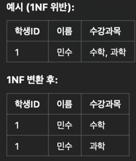
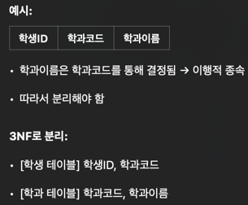

데이터베이스 정규화
=============

데이터베이스
---------
-------

## 1.정규화란?

정규화는 데이터를 논리적으로 분해햐여 중복을 제거하고, 데이터 간의 의미 있는 관계를 명확히 정의하는 과정이다. 이를 통해 삽입, 삭제, 갱신 이상을 방지할 수 있다.

## 2.정규화를 해야 하는 이유

* 삽입 이상: 데이터를 추가할 때 불필요한 정보까지 넣어야 하는 하는 문제
* 삭제 이상: 데이터를 삭제할 때 원하지 않는 정보까지 사라지는 문제
* 갱신 이상: 하나의 정보가 여러 곳에 중복되어 있어 모두 수정해야 하는 문제

정규화를 통해 이런 문제를 방지하고, 데이터의 일관성을 유지할 수 있다.

## 3.정규화의 단계

1. 제0정규형(Unnormalized Form, UNF)
* 테이블에 중복된 데이터, 반복되는 그룹이 존재
* 아직 아무런 정규화도 적용되지 않은 상태

2. 제1정규형(1NF: First Normal Form)

   각 칼럼은 원자값만 포함해야 한다.

* 하나의 셀에는 하나의 값만 있어야 한다.
* 배열, 리스트, 쉼표로 나열된 값이 있으면 안된다.

3. 제2정규형(2NF: Second Normal Form)

   1NF를 만족 + 부분 함수 종속 제거

* 기본 키가 복합 키일 때, 일부 키에만 종속된 속성을 제거해야 함
* 즉, 모든 속성이 전체 기본 키에 완전 종속되어야 함

  

4. 제3정규형(3NF: Third Normal Form)

   2NF 만족 + 이행 함수 종속 제거

* 기본 키가 아닌 칼럼을 통해 다른 컬럼이 결정되면 안 됨

  

5. BCNF

   3NF보다 더 엄격한 형태. 모든 결정자는 후보 키여야 함

* 3NF에서는 일부 결정자가 후보 키가 아닐 수도 있음

  예를 들어, 후보 키가 여러 개 일때 한 쪽만 기준으로 의존관계가 생기면 문제 -> 분해 필요

## 4.정규화의 단점
* JOIN이 많아져 성능 저하 가능성(과도한 정규화 시)
* 복잡한 쿼리 구조
* 일부 상황에서는 비정규화를 통해 성능 최적화 필요
